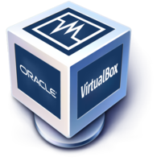

# Deliverable 1

## What is a web server? Hardware and software side
### Hardware Side
A web server can be refer to as  both hardware and software working together. On the hardware side a web server is a computer that stores web sever software. It also stores a website's component files. Examples being **HTML**, **Documents**, **Images**, and **Javascript Files**. The web server connects to the internet and support physical data interchange with other devices connected to the internet. 

### Software Side
On the software side a web server includes parts that control how the web user access hosted files. From a minimum this is an **HTTP Server**. A HTTP server is software that understand **URLS** and **HTTP** The HTTP server can be accessed though the domain name of the website it stores. Once accessed it delivers content to the end user's device. 

## What are some different web server applications?
The following table names just a few of the many different types of web server applications.

|Application name     | License                  | Project Website                      |
|---------------------| -------------------------| ------------------------------------ |
|Example 1            | Apache                   | [Example1](https://httpd.apache.org/)|
|Example 2            | Nginx                    | [Example2](https://www.nginx.com/)   |
|Example 3            | Caddy                    | [Example3](https://caddyserver.com/) |

### Example 1: Apache
  
Apache HTTP is the most highly used web server in the world. It provides powerful features such as dynamically loadable modules, Good media control, and extensive integration with other popular softwares. Apache is free and open source which allows flexibility and customization to the user.

### Example 2: Nginx 
  
Nginx like apache is an open source web server known for its high performance and low resource usage. Nginx excels in serving static content and mostly used as a load balancer and as a reverse proxy. Its highly compatible with many OS's and transcends the role of just being a web server.

### Example 3: Caddy
  
Caddy server is another open source web server built with the aim of simplifying the process of running and deploying web applications. It offers a wide set of features and a unique simplified approach to web server configuration. 

## What is virtualization?
Virtulization is computing technology that simulates physical hardware functionality to create software based services such as applications, servers, storage and networks. Virtualization allows us to create a virtual resource such as a desktop pc from one computer system and reduces the costs of hardware and can also increase efficency on personal or work related matters. 

## What is virtualbox?

Virtualbox is a popular open source program made by Oracle. Its a type 2 hypervisor that was made to virtualize machines at fast and reaiable speeds.

## What is a virtual machine?
A virtual machine is a computing resource that uses software instead of a physical computer to run programs deploy apps. A virtual machine is made to run on its own operating system and functions separately from other VMs even if they all come from the same host computer.

## What is Ubuntu Server?

Ubuntu server is an open source program made by Canonical. Its main usage is to serve up websites,file shares, and containers.

## What is a firewall?
The firewall found in Ubuntu server is called **Uncomplicated firewall**. It a default firewall configuration tool for ubuntu called **UFW**. Its developed to ewase iptables firewall configuration and provides a user friendly way to create IPV4 or IPV6 host based firewall.

## What is SSH?
SSH is known as Secure Socket Shell. Its a network protocol that gives users mostly system administrators a secure way to access a computer over an unsecured network. SSH can also refer to a suite of utilities that implement the SSH protocol. SSH provides strong password authentication and encrypted data between two computer connected to the internet. 