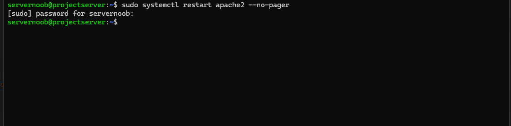
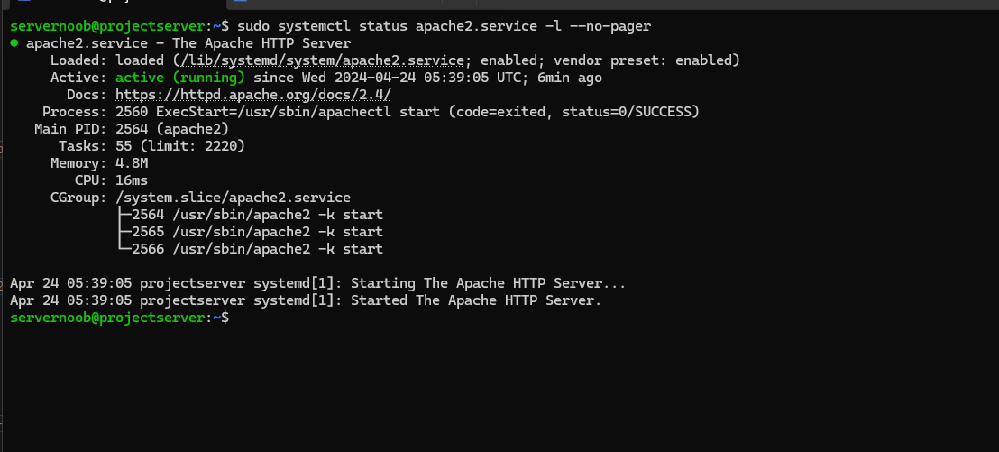

# Final Project Deliverable 2

## Question 1: What are the server hardware specifications(virtual machine settings)?

## Question 2: What is the Ubuntu server login screen

## Question 3: What is the IP address of your ubuntu server virtual machine
The IP address of my server virtual machine is 192.168.1.152. This can be found once you are logged into the server next to IPV4 address for enp0s3

## Question 4: How do you enable the Ubuntu Firewall?
You can enable the ubuntu firewall by running the command `sudo ufw enable`

## Question 5: How do you check if the Ubuntu Firewall is running?
You can check if the firewall is running by using the command `sudo ufw status`

## Question 6: How do you disable Ubuntu Firewall
You can disable the firewall by using the same command used to enable but opposite

## Question 7: How do you add apache to the firewall?
You can add apache to the firewall by running the following command `sudo ufw allow 'Apache'`

## Question 8: What is the command you used to install Apache?
The command used to install Apache is `sudo apt install apache2 -y`

## Question 9: What is the command you use to check if Apache is running
The command you would use to see if Apache is running is `sudo systemctl status apache2 --no-pager`

## Question 10: What is the command you use to stop Apache?
The command you would use to stop Apache is `sudo systemctl stop apache2 --no-pager`

## Question 11: What is the command you would use to restart Apache?
The command you would use to restart Apache would be `sudo systemctl restart apache2 --no-pager`

## Question 12: What is the command used to test Apache configuration?
The command used to test for Apache configuration is `sudo apachect1-t`

## Question 13: What is the command used to check the installed version of Apache?
The command you would use to check for the installed version of Apache is `sudo apache2 -v`

## Question 14: What are the most common commands to troubleshoot Apache errors?
The most common commands used to troubleshoot Apache errors are `systemctl`, `journalctl`, and `apachect1`
### Descriptions
* Systemctl is the first common command and is used to control and interact with Linux services via the `systemd ` service manager.
* Journalctl is the second common command and is used to query and view the logs that are generated by `systemd`.
* Apachect1 is the third common command and is used to check Apache's configuration.

#### Examples:

## Question 15: WHich are Apache log Files, and what are they used for?
Apache log Files are a helpful resource for troubleshooting. they are used to indicate a specific error with helpful diagnostic messages and error codes.
