# How to Setup a Web Server in VirtualBox and Ubuntu Server

## Introduction
This introduction will help you understand how to setup a **Web Sever** and **Ubuntu Server** while utilizing **VirtualBox**. I will go over all the necessary steps and also be providing basic terminology of what each program does.

## Basic Terminology

### VirtualBox
 
VirtualBox is a program used for virtualizing x86, AMD64,and Intel64 computing architecture enabling users to setup and deploy desktops, servers, and operating systems as virtual machines. VirtualBox is able to run all major OS's including Windows, Linux, and macOS.

### Ubuntu
 
Ubuntu is a free open source Linux based OS which can be used in a desktop or virtual server. Ubuntu is based off Debian which is another Linux based OS. Ubuntu was made to be more user friendly and easier to install.

### Apache
 
Apache is a free open source software used to allow users to deploy their websites to the internet. Apache is a major software aspect in making Web Severs as it allows to maintain a connection between the  web server and the internet.

### SSH
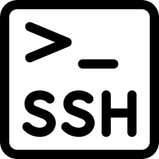 
Known as Secure Shell, this network protocol allows user particularly network administrator ways to access a computer over a unsecured network via remote access. Allowing the user to execute commands and more files from one computer to another.

### Firewall 

UFW is a user friendly framework for managing netfilter and a command line interface for working with the firewall

## Step by Step Instructions
### Step 1: Installing VirtualBox
In order to setup your Virtual Machine we will need to meet the minimum requirements. The minimum requirements needed to setup Ubuntu server is as follows
* **CPU: 1GHz or better Dual Core Processor**
* **RAM: 1024MB or better**
* **Storage: 5GB(ISO Installs) 4GB(Cloud images)**
The following image is what i use but you are allowed use either the min or more if your computer allows.
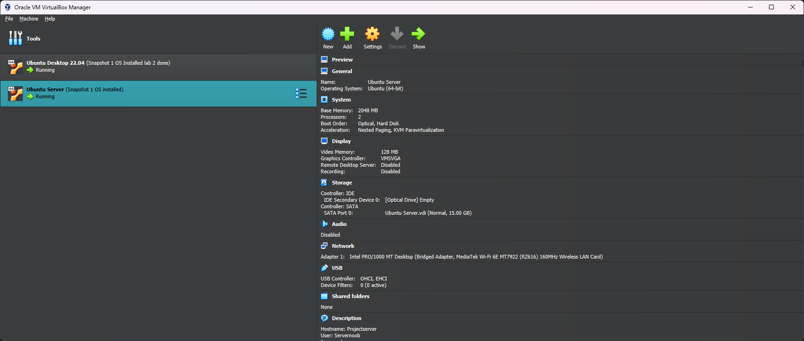

### Step 2: Installing Ubuntu Server
Once we have put the specs for our virtual machine and downloaded Ubuntu server from their website. The following images will guide you in order to still our os which will be Ubuntu Server

Here choose to install Ubuntu Server

Here you will choose english as our primary language
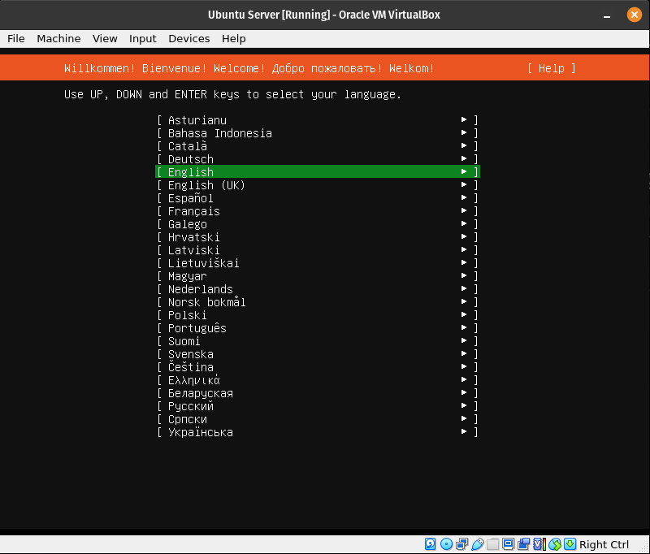

Here you will select **Update to New Installer**. This will allow us to to update the Ubuntu Installer and proceed with installation
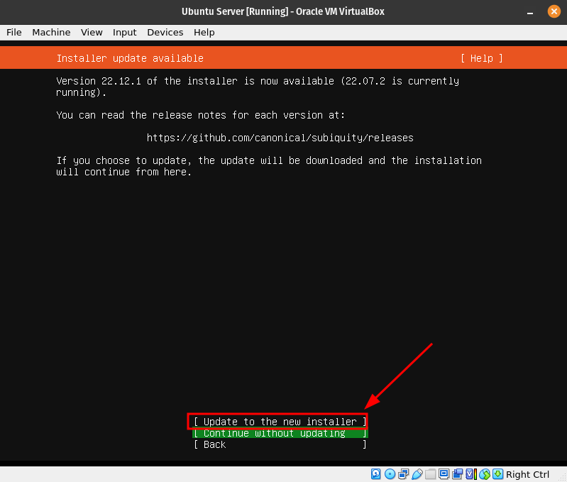

Here you can leave alone as it will auto adjust the language layout of our keyboard. If you notice any changes you will need to manually adjust.
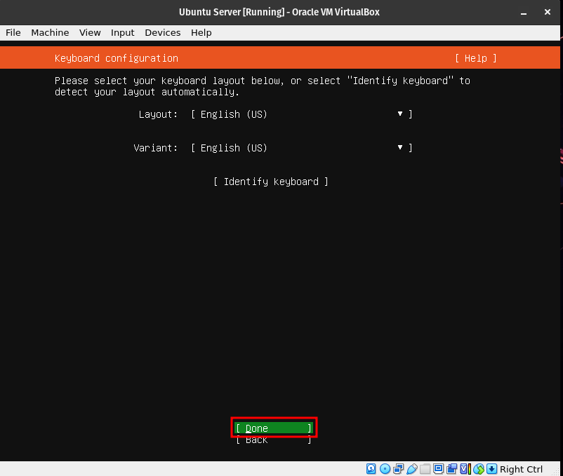

Here choose default Ubuntu Server installation. We will be using some of the repositories from the installation

Since we are installing Ubuntu in our VM which is configured at the moment to NAT network interface card, you will automatically get an IP address as long as your host pc as a internet connection. IF for whatever reason you don't get an IP address then their is an issue with your VM, Host machine, or Internet connection

Here you will leave empty as we are not using a proxy

Here no changes need to be made as we will be using the default mirror
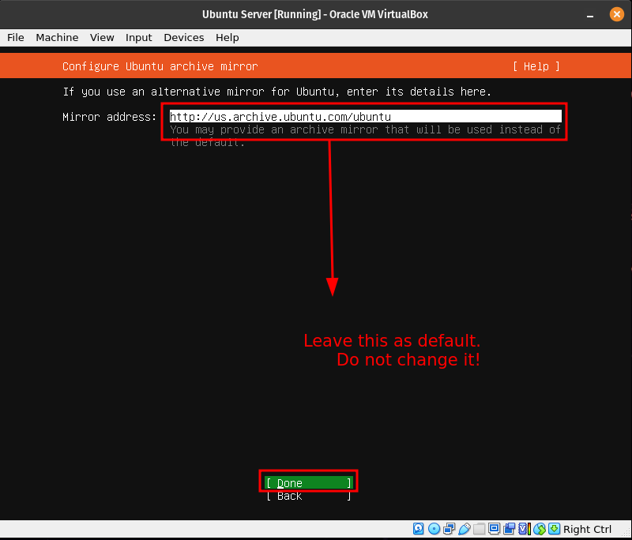

Here we will be formatting to use the entire disk. You can move around the options by utilizing the tab or arrow keys

Here you don't need to do anything but just press enter. This is informing us of the changes being made to the virtual hard drive

Here you will enter information for your virtual machine
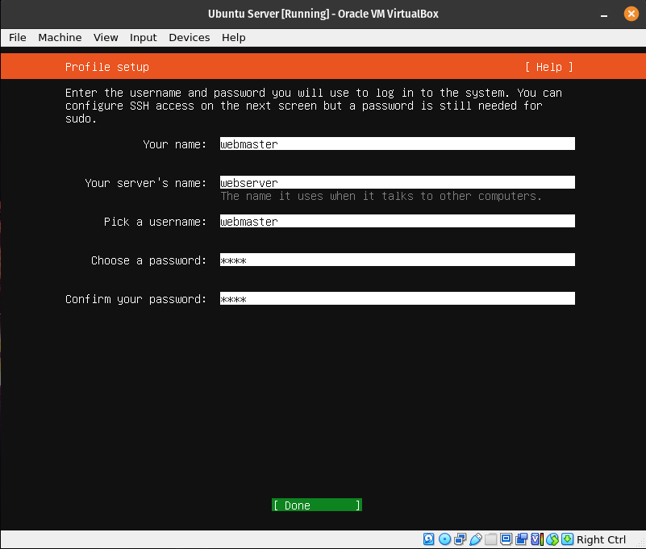

Here you will be installing ssh as this will be utilized in allowing us to setup remote access from our host machine

Here just press enter as no changes needed to be made. We won't be needing any of these services
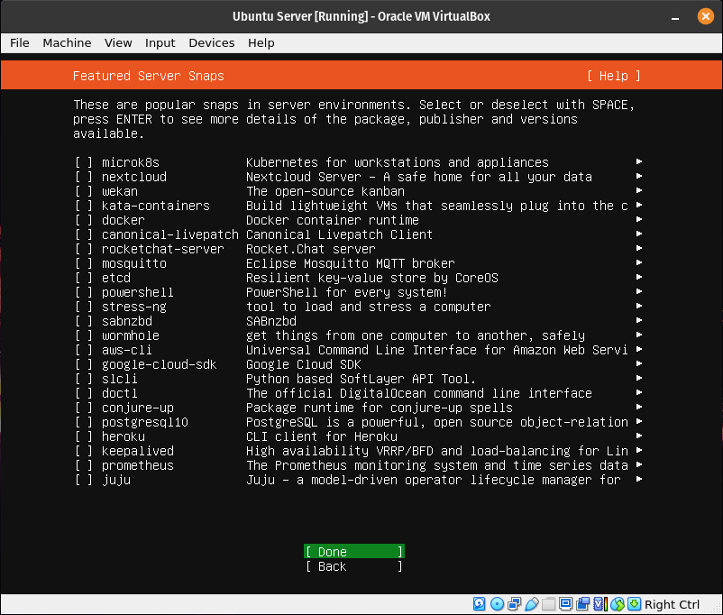

This is the installation process. Once complete you will update the system and choose to reboot afterwards
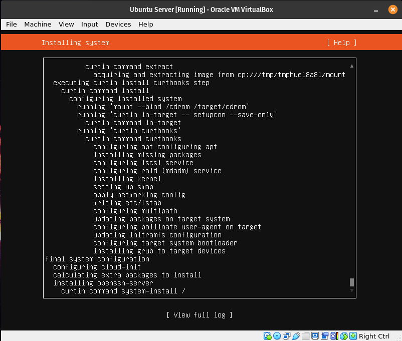

Here all you will need to press is enter and the disk will be unmounted. This completes the installation of Ubuntu Server

### Installing Apache
In order to install Apache we will need to login to our server. We will be using the information you put for your virtual machine as the login info. The password will be hidden when typing it in and pressing enter
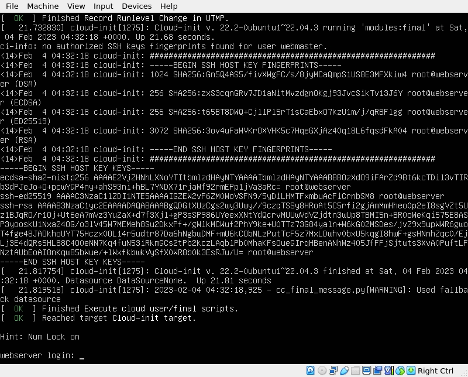

We want update Apache due to it being available in Ubuntu's default repositories. Its always a good idea to update before installing new packages. In order to update Apache well will be running this command in the server `sudo apt update; sudo apt upgrade -y`
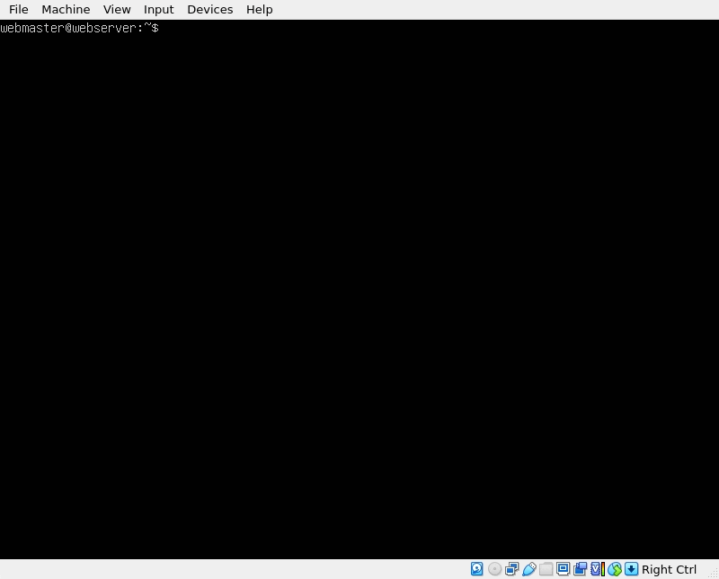

Now we will be installing Apache and in order to do this you will be running the following command in the server `sudo apt install apache2 -y` You might need to restart some services after running the command

### Setup SSH
Before we can setup SSH, we need to make sure our firewall is up and active. To activate your firewall run the following command `sudo ufw enable`

 We want to configure the firewall to allow traffic from Apache and SSH. To achieve this please run the following commands 
  * `sudo ufw allow 'Apache'`
  * `sudo ufw allow 'OpenSSH'`

 Now run the following command to check if our firewall is active `sudo ufw status`

 Now we want to check if our Apache and SSH traffic rules are active. To achieve this please run the following commands
  * `systemctl status apache2 --no-pager`
  * `systemctl status ssh --no-pager`

Check to make sure they both show `active(running)`. If you don't see this then you will need to restart the services. This is done by running the following command `sudo systemctl restart apache2 ssh`

### Setup Virtual Hosts
Virtual host allows us to serve more than one website in a single web server. By default Apache comes with one server block enabled. This block is severed in the directory `/var/www/html`

Here are the necessary steps to setup Virtual Host
Step 1: create a directory for `mywebsite` as follows
`sudo mkdir /var/www/mywebsite`

Step 2: You will modify the the ownership of `mywebsite`  with the following command `sudo chown -R $USER:$USER /var/www/mywebsite`so it is owned by you instead of the root.

Step 3: Change the file permissions so you can read, write, and execute the files. while also only allowing others to read the file
`sudo chmod -R 755 /var/www/mywebsite`

Step 4: You will create a simple html document from your new virtual host. The file should be called `index.html` made in the `/var/www/mywebsite/` directory with nano text editor. The following command will execute this `sudo nano /var/www/mywebsite/index.html`

Step 5: Once nano text editor opens you will type the following text 
<html>
    <head>
        <title>My First Website</title>
    </head>
    <body>
        <h1>This is a sample document!</h1>
    </body>
</html>

You will save and close once typed in. This can be down by `CTL+O` `ENTER` `then CTL+X`

If you wish to note use nano text editor type this command in to make the html file `sudo curl https://cis106.com/assets/basic.html -o /var/www/mywebsite/index.html`

Now we need to create a virtual host file for our content. The default configuration is located in `/etc/apache2/sites-available/000-default.conf` but we don't want to touch this file. In order to better practice our setup we will be making a new file called in nano called `sudo nano /etc/apache2/sites-available/mywebsite.conf`

You will add the following lines to the new file

ServerAdmin webmaster@localhost
ServerName mywebsite
ServerAlias www.mywebsite
DocumentRoot /var/www/mywebsite 
ErrorLog ${APACHE_LOG_DIR}/error.log

CustomLog ${APACHE_LOG_DIR}/access.log combined

Save the file and close by `CTL+O` `ENTER` `CTL+X`

You will now enable the site with the following command `sudo a2ensite mywebsite.conf`

Disable the site with this command `sudo a2dissite 000-default.conf`

Before you can refresh the config you will need to add a config line to the `apache2.conf` file. This can be done in nano. To open in nano type the following command `sudo nano /etc/apache2/apache2.conf`

provide the following line to the end of the file `ServerName 127.0.0.1`

Save and close the file. Once done you may test to see if there are any errors. Type the following command to test `sudo apache2ctl configtest`

If no errors are found the following output should show `Syntax OK`

Once done with the step above restart apache to apply any changes you've made. Type the following command to restart `sudo systemctl restart apache2`

You will open a web browser and type in the URL `http://ip.address.of.your.server/` The `index.html` file you created should appear if done correctly.

